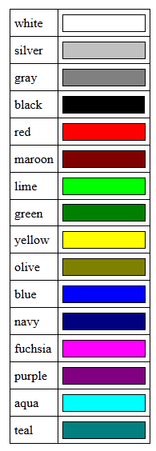

# C. LE CSS - Les Couleurs


#### Couleur du texte :

il n'existe que seize couleurs dites « standard » :



pour passer les titres en marron, on peut donc écrire :
  
```css
h1
{
    color: maroon;
}
```

Nous pouvons aussi utiliser la notation hexadécimale. de type : #FF5A28
Certains logiciels de dessin, comme Photoshop, Gimp et Paint.NET, vous indiquent les couleurs en hexadécimal. Il vous est alors facile de copier-coller le code hexadécimal d'une couleur dans votre fichier CSS.

Sinon, vous pouvez utiliser le site http://www.colorpicker.com

Ce qui nous donnera :

```css
h1
{
    color: #FF5A28;
}
```

On peut aussi utiliser la méthode rgb :

```css
h1
{
    color: rgb(240,96,204);
}
```

#### Couleur de fond :

On utilise la propriété CSS **background-color**

```css
/* On travaille sur la balise body, donc sur TOUTE la page */
body
{
    background-color: black; /* Le fond de la page sera noir */
    color: white; /* Le texte de la page sera blanc */
}
```

Remarque ici, j'ai utilisé une nouvelle notion : l'héritage.
Tout ce qui est dans la balise `<body>` hérite du CSS.
Si vous rajoutez des propriété sur d'autre balise a l'intérieur de `<body>`, elles prendront le dessus.

Vous pouvez des lors utiliser la balise HTML `<mark>` pour surligner n'importe quel texte.

```css
body
{
    background-color: black;
    color: white;
}

mark
{
    /* La couleur de fond prend le pas sur celle de toute la page */
    background-color: red;
    color: black;
}
```


#### Images de fond :

La propriété permettant d'indiquer une image de fond est **background-image**. Comme valeur, on doit renseigner **url("nom_de_l_image.png")**. Par exemple :

```CSS
body
{
    background-image: url("https://www.nimp.com/neige.png");
    background-attachment: scroll; /* ou sera fixe avec fixed */
    background-repeat: no-repeat; /* repeat-x repeat-y repeat */
}
```

Attention lorsque vous écrivez une adresse en relatif dans le fichier CSS ! L'adresse de l'image doit être indiquée par rapport au fichier.css et non pas par rapport au fichier.html. Pour simplifier les choses, je vous conseille de placer l'image de fond dans le même dossier que le fichier.css (ou dans un sous-dossier).

Position :
On peut indiquer où doit se trouver l'image de fond avecbackground-position. Cette propriété n'est intéressante que si elle est combinée avecbackground-repeat: no-repeat;(un fond qui ne se répète pas).

	background-position: 30px 50px;

ou

	background-position: top right;

- top : en haut
- bottom : en bas
- left : à gauche
- center : centré
- right : à droite


Ou, pour faire plus simple, nous pouvons utiliser une *super propriété* qui combine tout :

```CSS
body
{
    background: url("soleil.png") fixed no-repeat top right;
}
```

On peut même combiner plusieurs images, en faisant bien attention à l'ordre de déclaration des images :


```CSS
body
{
    background: url("soleil.png") fixed no-repeat top right, url("neige.png") fixed;
}
```