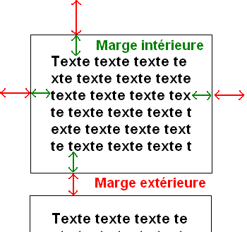
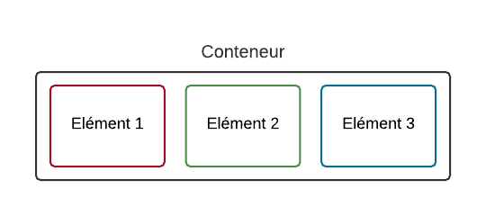
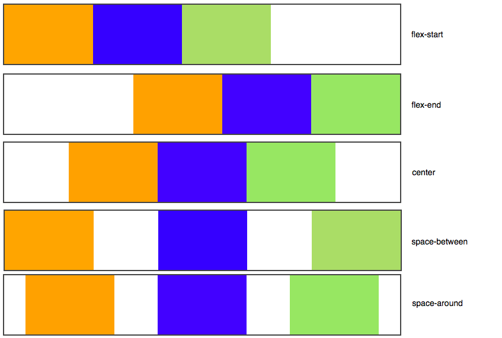
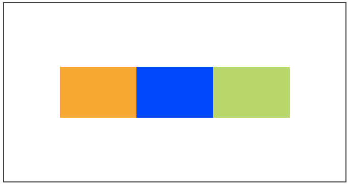
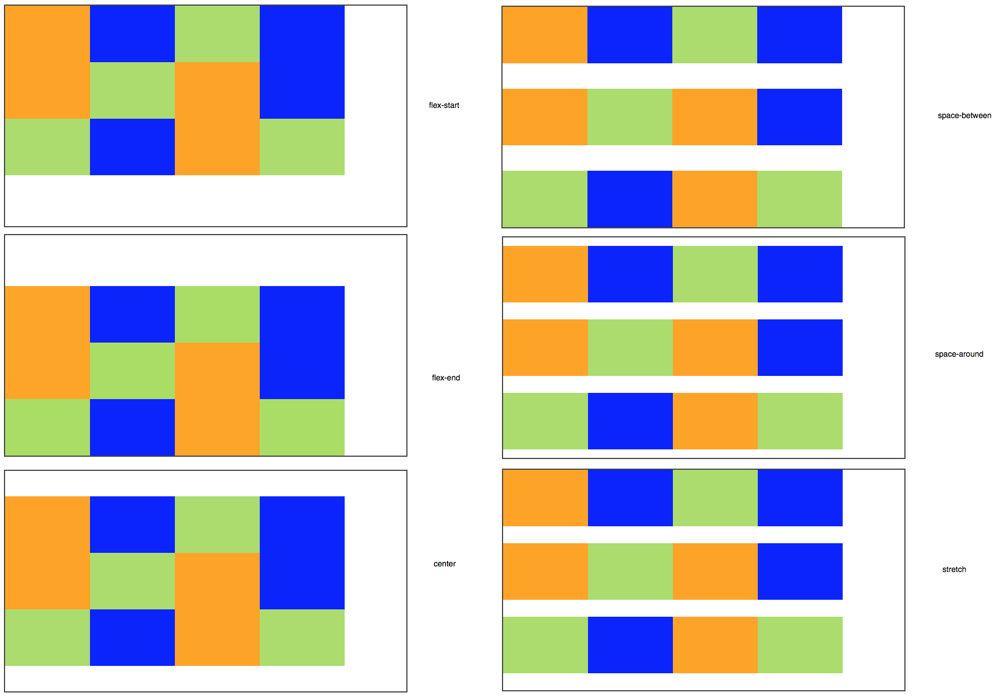
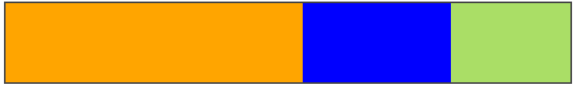

# Mise en Page du site

## Structuration :

Ces balises ne s'occupent pas de la mise en page. Elles servent seulement à indiquer à l'ordinateur le sens du texte qu'elles contiennent. On pourrait très bien placer l'en-tête en bas de la page si on le souhaite.

De l'importance d'utiliser les bonnes balises : Le référencement et la clarté.


Utilisez au maximum les balises prévues et crée pour.

Exemple d'un span inutile : `<span class="important">`. Je ne devrais jamais voir ceci dans un de vos codes alors qu'il existe la balise `<strong>` qui sert à indiquer l'importance !

Exemple d'un div inutile : `<div class="titre">`. Ceci est complètement absurde puisqu'il existe des balises faites spécialement pour les titres (`<h1>,<h2>`)

**TP : Créez une page structuré, vide, mais avec des couleurs de fond différéntes pour chaque section, tel le schéma plus haut. **

### Les dimensions 

Uniquement sur les balises de type block


```CSS
p
{
    border: 1px solid black;
	    
    width: 50%;  /* peut etre en pixel : 250px; */

    min-width: 400px;
    max-width: 600px;
}
```


On peut demander à ce qu'un bloc ait des dimensions minimales et maximales. C'est très pratique car cela nous permet de définir des dimensions « limites » pour que notre site s'adapte aux différentes résolutions d'écran de nos visiteurs.

### Les marges :

Deux types de marges :

- intérieure : padding
- extérieure : margin




```CSS
p
{	    
    width: 350px;
    border: 1px solid black;
    text-align: justify;
    padding: 12px;
    margin: 50px;
}
```

Possibilité de créer des marge que d'un coté :

- margin-top
- margin-bottom
- margin-left
- margin-right

Idem avec padding-top, etc etc...

Ou encore : `margin: 2px 0 3px 1px;`
Se lit dans le sens horaire, en partant vers le haut.

On peut aussi centrer horizontalement les blocks avec `margin: auto;`

```CSS
p
{
    width: 350px; /* On a indiqué une largeur (obligatoire) */
    margin: auto; /* On peut donc demander à ce que le bloc soit centré avec auto */
    border: 1px solid black;
    text-align: justify;
    padding: 12px;
    margin-bottom: 20px;
}
```


### Le dépassement :

Si vous voulez que le texte ne dépasse pas des limites du paragraphe, il va falloir utiliser la propriété **overflow**. Voici les valeurs qu'elle peut accepter :

- visible(par défaut) : si le texte dépasse les limites de taille, il reste visible et sort volontairement du bloc.
- hidden: si le texte dépasse les limites, il sera tout simplement coupé. On ne pourra pas voir tout le texte.
- scroll: là encore, le texte sera coupé s'il dépasse les limites. Sauf que cette fois, le navigateur mettra en place des barres de défilement pour qu'on puisse lire l'ensemble du texte. C'est un peu comme un cadre à l'intérieur de la page.
- auto: c'est le mode « pilote automatique ». En gros, c'est le navigateur qui décide de mettre ou non des barres de défilement (il n'en mettra que si c'est nécessaire). C'est la valeur que je conseille d'utiliser le plus souvent.


Pour les textes trop large, souvent le cas avec les url, on utilise `word-wrap: break-word;`


## Flexbox !

Le principe est simple. Vous définissez un conteneur, et à l'intérieur vous placez plusieurs éléments.



Exemple :

```HTML
<!DOCTYPE html>
<html>
    <head>
        <meta charset="utf-8" />
        <link href="style.css" rel="stylesheet">
        <title>Testons flexbox</title>

    </head>

    <body>

        <div id="conteneur">
            <div class="element orange">Elément 1</div>
            <div class="element vert">Elément 2</div>
            <div class="element jaune">Elément 3</div>
        </div>

    </body>
</html>
```

```CSS
#conteneur
{
    display: flex;
}
```

Amusons nous un peu avec flexbox :

#### La direction :

**flex-direction** :

- row
- column
- row-reverse
- column-reverse

```CSS
#conteneur
{
	border: 1px solid black;
    display: flex;
    flex-direction: row-reverse;
}
```

#### Retour à la ligne :

Le retour à la ligne pour faire du responsive !

```CSS
#conteneur
{
    display: flex;
    flex-wrap: wrap;
}
```

- nowrap : pas de retour à la ligne ( par défaut )
- wrap : les éléments vont à la ligne lorsqu'il n'y a plus la place
- wrap-reverse : les éléments vont à la ligne lorsqu'il n'y a plus la place en sens inverse


#### Alignement

avec : **justify-content**

- flex-start : alignés au début (par défaut)
- flex-end : alignés à la fin
- center : alignés au centre
- space-between : les éléments sont étirés sur tout l'axe (il y a de l'espace entre eux)
- space-around : idem, les éléments sont étirés sur tout l'axe, mais ils laissent aussi de l'espace sur les extrémités



Fonctionne aussi si l'axe est vertical :

```CSS
#conteneur
{
    display: flex;
    flex-direction: column;
    justify-content: center;
    height: 350px; /* Un peu de hauteur pour que les éléments aient la place de bouger */
}
```


##### Les axes secondaires :

- Si vos éléments sont organisés horizontalement, l'axe secondaire est l'axe vertical.
- Si vos éléments sont organisés verticalement, l'axe secondaire est l'axe horizontal.

Nous les alignons avec la propriété **align-items**

- stretch : les éléments sont étirés sur tout l'axe (valeur par défaut)
- flex-start : alignés au début
- flex-end : alignés à la fin
- center : alignés au centre
- baseline : alignés sur la ligne de base (semblable à flex-start)

exemple :

```CSS
#conteneur
{
    display: flex;
    justify-content: center;
    align-items: center;
    height: 350px; /* Un peu de hauteur pour que les éléments aient la place de bouger */
}
```




Comme cela va nous être utile assez souvent, il existe un raccourci bien pratique :

```
#conteneur
{
    display: flex;
}

.element
{
    margin: auto;
}
```


#### Répartition multi lignes :

Dans le cas de nombreux éléments, nous pouvons utiliser **align-content** :

- flex-start : les éléments sont placés au début
- flex-end : les éléments sont placés à la fin
- center : les éléments sont placés au centre
- space-between : les éléments sont séparés avec de l'espace entre eux
- space-around : idem, mais il y a aussi de l'espace au début et à la fin
- stretch (par défaut) : les éléments s'étirent pour occuper tout l'espace

Exemple :
```HTML
<!DOCTYPE html>
<html>
    <head>
        <meta charset="utf-8" />
        <link href="style_exemple_flexbox.css" rel="stylesheet">
        <title>Testons flexbox</title>

    </head>

    <body>

        <div id="conteneur">
            <div class="element orange">Elément 1</div>
            <div class="element vert">Elément 2</div>
            <div class="element jaune">Elément 3</div>
            <div class="element orange">Elément 4</div>
            <div class="element vert">Elément 5</div>
            <div class="element jaune">Elément 6</div>
            <div class="element orange">Elément 7</div>
            <div class="element vert">Elément 8</div>
            <div class="element jaune">Elément 9</div>
            <div class="element orange">Elément 10</div>
            <div class="element vert">Elément 11</div>
            <div class="element jaune">Elément 12</div>                                    
        </div>

    </body>
</html>
```

```CSS
#conteneur
{
	border: 4px solid black;
    display: flex;
    flex-wrap: wrap;
    align-content: center;

    height: 500px

}
```




#### Aligner un seul élément :

Propriété **align-self**
mêmes valeurs que **align-content**


#### Mise en ordre :

Propriété **order**

exemple :

```CSS
.jaune
{
	background-color: yellow;
	order :10;
	align-self: flex-end; /* Seul ce bloc sera aligné à la fin */
}
```

#### Taille :

Propriété **flex**

fonctionne par rapport. un flex: 2; sera deux fois plus gros qu'un flex: 1;

