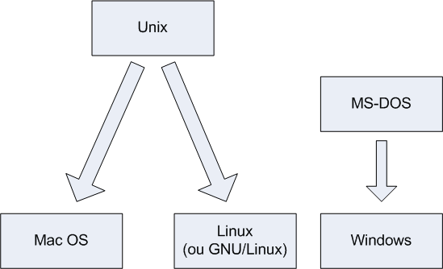
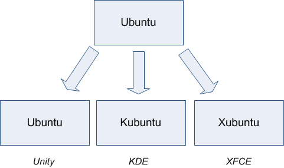
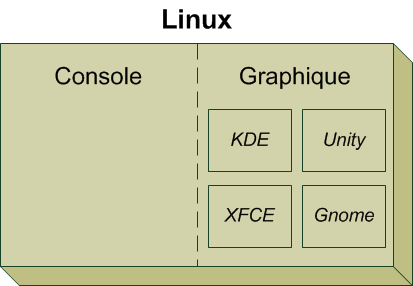

# LINUX - Quessessé ?


---

TODO: https://korben.info/present-des-vrais-slides-de-barbu-e-s.html


## Un peu d'histoire :

Au commencement ( en 1984 ), il y avait comme système d'exploitation (OS) des ordinateurs installé par defaut : MS-DOS. Mais loin d'être abouti, d'autre existaient, plus pro, plus compliqué, plus cher aussi. Comme Unix. Bien plus ancien, ses origines remontent à 1969 !

Graphiquement, rien ne dépasse la console : texte blanc sur fond noir.

En 1984, ( probablement en réponse à ma naissance ), un ingénieur chercheur en intélligence artificielle au MIT créa le projet GNU ( Gnu's Not Unix ! ). Un OS qui sera presque une copie de Unix, avec les même commandes, mais gratuit. Mais surtout : Libre.

Libre, quessessé ? Un programme libre est fourni avec le code source. Avec tout son moteur, tout. On peut l'auditer, voir comment il a été conçu, vérifier s'il y a des bugs, etc.

En 1991, un étuduant de l'université de Helsinki (Finlande) va pondre un autre OS : Linux, jeux de mot avec Unix et Linus Torvalds, son nom.

Et puis un jour ils se sont dit tout les deux que leur deux projets se ressemblaient fortement. Mieux encore, ils se complètent. Linux est focalisé sur le coeur du système. Le noyau, le Kernel. La ou Stallman à beaucoup plus travaillé sur la couche logicielle.

Du coup, pouf, aujourd'hui encore, il nous faut parler du projet GNU/Linux si nous souhaitons être complet.





Linux est un système d'exploitation extrémement riche. Il y a de très nombreux logiciels différent, et des centaines de façon de les installer et de les utiliser.

Pour simplifier ( ou pas ) la vie des users, certaines entreprises ou personnes ont crée ce que nous appellons une distribution. C'est a dire ni plus ni moins qu'une façon bien à eux d'utiliser l'OS Linux. Et il en existe un gros paquet :

- Mx Linux

- Manjaro

- Mint

- Debian

- Ubuntu

- Fedora

- Arch

Nous, nous allons utiliser Debian. Pourquoi ? Parce que c'est moi qui décide.

Et aussi parce que c'est vachement bien. Debian est maintenue par des particuliers bénévoles en majorité. La ou les autres sont des entreprises. Et puis apt-get c'est quand même vachement bien.

On va même faire plus qu'utiliser Debian, on va utiliser une surcouche : Ubuntu. Qui est une distribution... de distribution :)


Pourquoi Ubuntu ?

- Elle est prévue pour le **grand public**,
   c'est-à-dire des gens comme vous et moi qui n'ont pas envie de se 
  prendre la tête pour utiliser leur ordinateur. Le slogan est *« Linux for human beings »*, ce qui signifie « Linux pour des êtres humains ». Cela veut tout dire.

- **Les mises à jour sont fréquentes** :
   les développeurs travaillent d'arrache-pied et une nouvelle version de 
  la distribution sort tous les six mois environ, ce qui vous permet de 
  disposer des dernières nouveautés.

- Il y a beaucoup d'utilisateurs, donc **beaucoup de gens pour vous aider** si vous avez des questions (un point à ne pas négliger !).

#### En résumé

- Le **système d'exploitation** est l'outil qui fait le lien entre votre machine et vos programmes.

- Windows, Mac OS et Linux sont les systèmes d'exploitation les plus connus.

- Linux a la particularité d'être **libre**,
   c'est-à-dire que son code source (sa recette de fabrication) est 
  ouvert : tout le monde peut le consulter. Par opposition, le code source
   qui a permis de concevoir Windows et Mac OS est fermé, on dit que ce 
  sont des systèmes d'exploitation propriétaires.

- Il existe de nombreuses variantes de Linux, que l'on appelle **distributions**.

- **Ubuntu** est une des distributions les plus populaires à l'heure actuelle. C'est
   celle que nous utiliserons tout au long de cet ouvrage. Il s'agit d'un 
  dérivé de la distribution Debian.


## A quoi ressemble Linux ?

A rien. De base, Linux est un système d'exploitation sans interface graphique. Il va falloir en choisir une. Et il en existe un gros paquet. Des moches et fonctionnelles, à des sublimes mais inutiles. A vous de choisir.

Mais ce n'est pas obligatoire. Aucun des serveur qui hebergent internet ne tournent sous interfaces graphique. Moi même, j'utile 50% de mon temps sur Linux a travers la console. Je n'utilise l'interface graphique que pour faire du traitement de texte, surfer sur le net et regardé des vidéos. Je vais beaucoup plus vite pour tout le reste en CLI ( copie de fichier, gestion d'application web/serveur, etc etc.. )

#### Serveur X :

Toute les interfaces graphique sont basé sur le même programme : X. C'est la brique graphique de Linux. Par dessus X se greffe un gestionnaire de fenetre ( ou de bureau ). Les plus célèbres :

- Gnome

- KDE

- Lxde

- XFCE

- Unity ( entérré depuis le retour à gnome de ubuntu 18.04 de base. Il en etait une pale copie de toute façon... )
  
  





### Installation :

Récuperer l'iso préféré. Perso, je vous conseille la 18.04 LTS. LTS pour Long Term Support. Mais si vous voulez avoir quelque chose de neuf, vous pouvez utiliser les dernière version. Une LTS sort tout les deux ans chez Canonical.

https://ubuntu.com/#download

Récupérez une clef usb d'au moins 4GO.

Si vous etes sous windows, utilisez le logiciel Rufus. Gratuit, rapide, simple, efficace.

Si vous ête sous Linux, il y a souvent un logiciel prévu. Sous ubuntu, chercher Usb Creator. Vous pouvez aussi utiliser la commande dd :

```bash
dd if=./ubuntu.iso of=/dev/sdc bs=4 status=progress
```

Si vous êtes sous mac, debrouillez vous. Je touche pas à ça.

Bootez ensuite sur la clé USB en changeant l'ordre de boot dans le bios. ( F2 ou F10 ou autre au demarrage, ça dépend des marques ... )

Ensuite, ça boote, et on suit gentillement les instructions.

#### En résumé

- Linux peut être utilisé de deux façons différentes : en mode console ou en mode graphique.

- Le **mode console** est puissant mais plus délicat à apprivoiser. Les débutants préfèrent l'éviter au début.

- Le **mode graphique** est similaire à ce que vous connaissez sous Windows et Mac OS : on y manipule des fenêtres avec une souris.

- Il existe plusieurs variantes du mode graphique que l'on appelle **gestionnaires de bureau** : Unity, KDE, XFCE...

- Pour obtenir Ubuntu, il suffit de télécharger gratuitement une **image de disque** (format`.iso`) et de crer une clé USB bootable.
