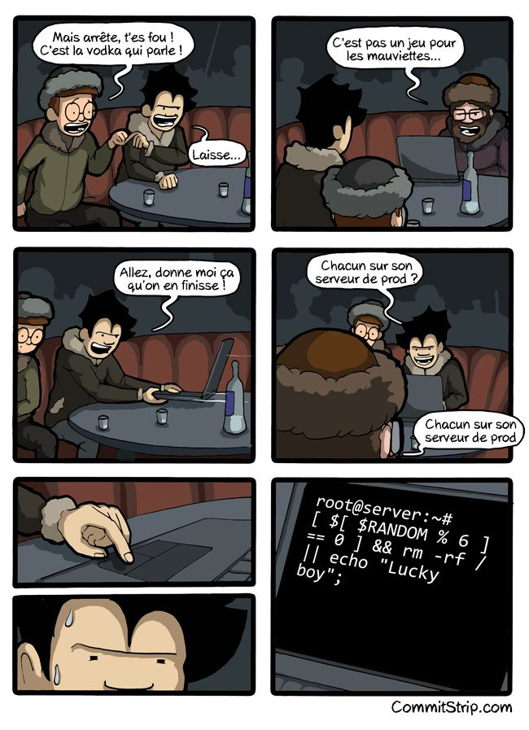
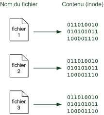
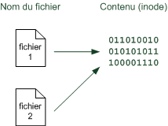
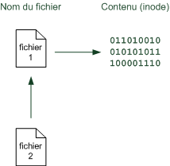

# La structure des dossiers et fichiers.

Le système qui gère les fichiers sous Linux est un peu déroutant au début,
 surtout quand on est habitué à celui de Windows. En effet, ici vous ne 
trouverez pas de`C:\`,`D:\`ou que sais-je encore. Les fichiers sont organisés d'une manière complètement différente.

Au lieu de séparer chaque disque dur, lecteur CD, lecteur de disquettes, 
lecteur de carte mémoire… Linux place en gros tout au même endroit.

Pour faire simple, il existe deux grands types de fichiers sous Linux :

- **les fichiers classiques** : ce sont les fichiers que vous connaissez, ça comprend les fichiers texte (`.txt`,`.doc`,`.odt`…), les sons (`.wav`,`.mp3`,`.ogg`), mais aussi les programmes. Bref, tout ça, ce sont des fichiers que vous connaissez et que vous retrouvez dans Windows ;

- **les fichiers spéciaux** : certains autres fichiers sont spéciaux car ils **représentent** quelque chose. Par exemple, votre lecteur CD est un fichier pour Linux.
   Là où Windows fait la distinction entre ce qui est un fichier et ce qui
   ne l'est pas, Linux, lui, dit que **tout est un fichier**. C'est une conception très différente, un peu déroutante comme je vous l'ai dit, mais pas de panique, vous allez vous y faire.

### La racine

Dans un système de fichiers, il y a toujours ce qu'on appelle une racine, c'est-à-dire un « **gros dossier de base qui contient tous les autres dossiers et fichiers** ».

Sous Windows, il y a en fait plusieurs racines.`C:\`est la racine de votre disque dur,`D:\`est la racine de votre lecteur CD (par exemple).  
Sous Linux, **il n'y a qu'une et une seule racine** : « `/` ».
 Comme vous le voyez, il n'y a pas de lettre de lecteur car justement, 
Linux ne donne pas de nom aux lecteurs comme le fait Windows. Il dit 
juste « **La base, c'est`/`** ».

- **bin** : contient des programmes (exécutables) susceptibles d'être utilisés par tous les utilisateurs de la machine.

- **boot** : fichiers permettant le démarrage de Linux.

- **dev** :
   fichiers contenant les périphériques. En fait – on en reparlera plus 
  tard – ce dossier contient des sous-dossiers qui « représentent » chacun
   un périphérique. On y retrouve ainsi par exemple le fichier qui 
  représente le lecteur CD.

- **etc** : fichiers de configuration.

- **home** :
   répertoires personnels des utilisateurs. On en a déjà parlé un peu 
  avant : c'est dans ce dossier que vous placerez vos fichiers personnels,
   à la manière du dossier`Mes documents`de Windows.

- **lib** : dossier contenant les bibliothèques partagées (généralement des fichiers`.so`) utilisées par les programmes. C'est en fait là qu'on trouve l'équivalent des`.dll`de Windows.

- **media** :
   lorsqu'un périphérique amovible (comme une carte mémoire SD ou une clé 
  USB) est inséré dans votre ordinateur, Linux vous permet d'y accéder à 
  partir d'un sous-dossier de`media`. On parle de **montage**.

- **mnt** : c'est un peu pareil que`media`, mais pour un usage plus temporaire.

- **opt** : répertoire utilisé pour les *add-ons* de programmes.

- **proc** : contient des informations système.

- **root** : c'est le dossier personnel de l'utilisateur « root ». Normalement, les dossiers personnels sont placés dans`home`,
   mais celui de « root » fait exception. En effet, comme je vous l'ai dit
   dans le chapitre précédent, « root » est le superutilisateur, le 
  « chef » de la machine en quelque sorte. Il a droit à un espace spécial.

- **sbin** : contient des programmes système importants.

- **tmp** : dossier temporaire utilisé par les programmes pour stocker des fichiers.

- **usr** : c'est un des plus gros dossiers, dans lequel vont s'installer la plupart des programmes demandés par l'utilisateur.

- **var** : ce dossier contient des données « variables », souvent des *logs* (traces écrites de ce qui s'est passé récemment sur l'ordinateur).

- 

### `pwd` : afficher le dossier actuel

### `which` : connaître l'emplacement d'une commande

### `ls` : lister les fichiers et dossiers

-a : aficher les fichier et dossier caché ( avec un . )

Avec ls -l :

1. droits sur le fichier (on fera un chapitre entier pour expliquer comment fonctionnent les droits sous Linux) ;

2. nombre de liens physiques (cela ne nous intéresse pas ici) ;

3. nom
    de la personne propriétaire du fichier (là, c'est moi !). Si le fichier
    avait été créé par quelqu'un d'autre, par exemple Patrick, on aurait vu
    son nom à la place ;

4. groupe
    auquel appartient le fichier (on en reparlera dans le chapitre sur les 
   droits). Il se peut que le nom du groupe soit le même que celui du 
   propriétaire ;

5. taille du fichier, en octets ;

6. date de dernière modification ;

7. nom du fichier (ou dossier).
   
   `-t` : trier par date de dernière modification

### `cd` : lister les fichiers et dossiers

.. et ./ : les chemin relatifs et chemin absolus.

Auto complétion et home.

### `du` : taille occupée par les dossiers

-a -h -s

#### En résumé

- Sous Linux, tout est organisé sous forme de fichiers. Il n'y a pas de lecteur du type`C:`comme sous Windows.

- Les dossiers sont imbriqués entre eux à partir du dossier parent principal`/`. On l'appelle la **racine**.

- Le dossier dans lequel les utilisateurs stockent leurs documents est`/home`. Si votre login est`patrick`, alors votre dossier personnel sera`/home/patrick`.

- La commande`pwd`permet de savoir en console dans quel dossier on se situe.

- `ls`affiche la liste des fichiers présents dans le dossier actuel.

- `cd`permet de changer de dossier.

# La manipulation des fichiers.

#### `cat` : afficher tout le fichier

#### `less` : afficher le fichier page par page

- `Espace` : affiche la suite du fichier. La touche`Espace`fait défiler le fichier vers le bas d'un « écran » de console. C'est celle que j'utilise le plus souvent.

- `Entrée` : affiche la ligne suivante. Cela permet donc de faire défiler le fichier vers le bas ligne par ligne.

Vous pouvez aussi utiliser la touche`Flèche vers le bas`.

- `d` : affiche les onze lignes suivantes (soit une moitié d'écran). C'est un peu l'intermédiaire entre`Espace`(tout un écran) et`Entrée`(une seule ligne).

- `b` : retourne en arrière d'un écran.

- Vous pouvez aussi appuyer sur la touche`Page Up`.

- `y` : retourne d'une ligne en arrière.

- Vous pouvez aussi appuyer sur la touche`Flèche vers le haut`.

- `u` : retourne en arrière d'une moitié d'écran (onze lignes).

- `q` : arrête la lecture du fichier. Cela met fin à la commande`less`.

- `=` : indique où vous en êtes dans le fichier (numéro des lignes affichées et pourcentage).

- `h` : affiche l'aide (toutes les commandes que je vous apprends ici, je les tire de là). Tapez`q`pour sortir de l'aide.

- `/` : tapez`/`suivi du texte que vous recherchez pour lancer le mode recherche. Faites`Entrée`pour
   valider. Pour ceux qui savent s'en servir, sachez que les expressions 
  régulières sont acceptées. 

- `n` : après avoir fait une recherche avec`/`, la touche`n`vous
   permet d'aller à la prochaine occurrence de votre recherche. C'est un 
  peu comme si vous cliquiez sur le bouton « Résultat suivant ».

- `N` : pareil que`n`, mais pour revenir en arrière.

#### `head` : afficher le début du fichier

#### `tail` : afficher la fin du fichier

-n nbr de ligne

-f pour suivre les modif en temps réel

#### `touch` : créer un fichier

La commande`touch`est
 à la base faite pour modifier la date de dernière modification d'un 
fichier. D'où son nom : on « touche » le fichier pour faire croire à 
l'ordinateur qu'on vient de le modifier alors que l'on n'a rien changé. 
Ça peut se révéler utile dans certains cas précis qu'on ne verra pas 
ici.

L'intérêt de`touch`pour nous dans ce chapitre, c'est que si le fichier n'existe pas, il sera créé ! On peut donc **aussi** utiliser`touch`pour créer des fichiers, même s'il n'a pas vraiment été fait pour ça à la base.

#### `mkdir` : créer un dossier

mkdir -p animaux/vertebres/chat

#### `cp` : copier un fichier

```bash
cp fichierbidon mondossier/ #copier dans
cp fichierbidon mondossier/fichiercopie #copie et renomme
cp -R animaux autresanimaux #recursif, tout les sous dossier
cp *.jpg mondossier/ #wildcard, copie tout les .jpg
cp so* mondossier/
```

#### `mv` : déplacer un fichier

Très proche de`cp`, la commande`mv`(*MoVe*, « déplacer » en anglais) a en fait deux utilités :

- déplacer un fichier (ou un dossier) ;

- renommer un fichier (ou un dossier).

```bash
mv fichierbidon mondossier/ #deplacement dans
mv fichierbidon superfichier #renommer
```

#### `rm` : supprimer un fichier

```bash
rm fichier
rm -i fichier # pour confirmation
rm -f fichier # forcer
rm -v fichier # verbose
rm -r # surpprimer un dossier et son contenu
```



#### `ln` : Créer des liens entre fichiers.

elle permet de **créer des raccourcis**, qu'on appelle des **liens** sous Linux et qui sont de deux types :

- des liens **physiques** ;

- des liens **symboliques**.

##### Le stockage des fichiers

Sur le disque dur, chaque fichier est grosso-modo séparé en trois parties :

- son nom ;

- les infos de gestion de droits

- son contenu.

Chaque contenu se voit attribuer un numéro d'identification appelé **inode**



Un lien physique permet d'avoir deux noms de fichiers qui partagent 
exactement le même contenu, c'est-à-dire le même inode (figure 
suivante).



```bash
mkdir test
touch fichier1
ln fichier1 fichier2
ls -li
```

Le principe du lien symbolique est que l'on crée un lien vers un autre 
nom de fichier. Cette fois, on pointe vers le nom de fichier et non vers
 l'inode directement (figure suivante).



```bash
ln -s fichier1 fichier3
ls -li
```

Si vous supprimez`fichier3`, il ne se passe rien de mal. Par contre, si vous supprimez`fichier1`,`fichier3`pointera vers un fichier qui n'existe plus. Le lien symbolique sera cassé et ne servira donc plus à rien. On parle de « lien mort » .

D'autre part, l'avantage des liens symboliques est qu'ils fonctionnent aussi sur des répertoires, contrairement aux liens physiques.

#### En résumé

- `cat`permet d'afficher tout le contenu d'un fichier, mais lorsque celui-ci est long, il est préférable d'utiliser`less`qui affiche le fichier page par page.

- On peut obtenir uniquement le début ou la fin d'un fichier avec`head`et`tail`. En utilisant`tail -f`on
   peut suivre l'évolution d'un fichier en temps réel, ce qui est utile 
  sur les fichiers de log qui enregistrent l'activité du système.

- `mkdir`permet de créer un dossier,`touch`permet de créer un fichier vide.

- `cp`permet de copier un fichier ou un dossier, tandis que`mv`permet de les déplacer ou de les renommer.

- `rm`supprime un fichier. Il n'y a pas de corbeille en console, la suppression est définitive ; il faut donc être prudent.

- On peut créer des liens (raccourcis) vers des fichiers et dossiers à l'aide de la commande`ln`.
