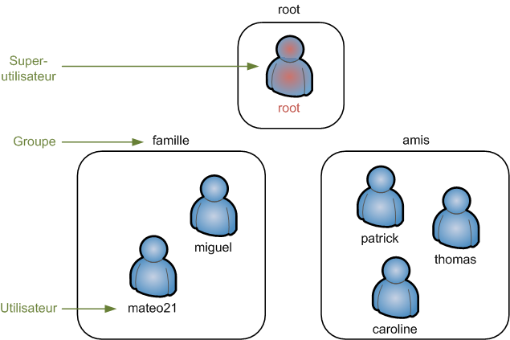
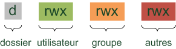

# Les utilisateurs et les droits

Linux est un système multi-utilisateurs. Cela signifie que plusieurs 
personnes peuvent travailler simultanément sur le même OS, en s'y 
connectant à distance notamment.

On peut créer autant d'utilisateurs que l'on veut, eux-mêmes répartis dans des groupes.  Il y a un utilisateur « spécial », **root**, aussi appelé superutilisateur. Celui-ci a tous les droits sur la machine.



On ne se connecte en root que très rarement, **lorsque c'est nécessaire**. Certaines commandes de Linux que nous allons voir dans ce chapitre ne sont accessibles qu'à root.  Le reste du temps, on utilise le compte « limité » que l'on a créé (mateo21 dans mon cas).

Cette
 simple protection permet de largement limiter les dégâts en cas de 
fausse manipulation, de virus sur votre PC, etc. En effet, un virus ne 
peut rien faire de plus que vous quand vous êtes connectés avec des 
droits limités. En revanche, si vous êtes en root il pourra tout faire, 
même détruire votre ordinateur.  Sous Windows, vous êtes toujours 
connectés en administrateur par défaut (équivalent de root), ce qui 
explique pourquoi les virus y sont si dangereux.

#### `sudo` : devenir root un instant

#### `sudo su` : devenir root et le rester

Maintenant que vous savez passer root (temporairement ou indéfiniment), nous allons
 pouvoir découvrir des commandes qui sont réservées à root.  `adduser` et `deluser` sont de celles-là. Si vous essayez de les appeler avec votre utilisateur normal, on vous dira que vous n'avez pas le droit de les utiliser. Seul root peut gérer les utilisateurs.

#### `adduser` : ajouter un utilisateur

#### `passwd` : changer le mot de passe

#### `deluser` : supprimer un compte

Ne supprimez en aucun cas votre compte utilisateur ! En effet, si je le fais, il n'y aura plus que root sur la machine… et Ubuntu interdit de se `logger` en root. Par conséquent, au prochain démarrage de la machine vous ne pourrez pas vous connecter… et vous serez complètement coincés !

deluser --remove-home patrick


## Gestion des groupes

Chaque user appartient à un groupe. Si vous ne définissiez rien, un groupe du même nom que l'user sera automatiquement créé. Faites un ls -l pour vérifier les groupes.

#### `addgroup` : créer un groupe

#### `usermod` : modifier un utilisateur

- **-l** : renomme l'utilisateur (le nom de son répertoire personnel ne sera pas changé par contre) ;

- **-g** : change de groupe. Un par un

- **-G** : change plusieurs groupes. ex : usermod -G amis,paris,collegues patrick

- **-a** : Garde les précédents groupe, et ajoute ex : usermod -aG amis Patrick


Faites très attention en utilisant `usermod` ! Lorsque vous avez recours à `-G`, l'utilisateur change de groupe et ce peu importe les groupes auxquels il appartenait auparavant.  
Si vous voulez **ajouter** des groupes à un utilisateur (sans perdre les groupes auxquels il appartenait avant cela), utilisez `-a` :  
`usermod -aG amis patrick`

Ou, mieux :

#### `adduser user groupe`


#### `delgroup` : supprimer un groupe

`addgroup` et `delgroup` n'existent que sous Debian et ses dérivés (même remarque que pour `adduser` et `deluser`).  
Les commandes « traditionnelles » qui fonctionnent partout sont `groupadd` et `groupdel`, mais elles offrent moins d'options.


#### `chown` : changer le propriétaire d'un fichier

On peut changer le proprio et le groupe proprietaire d'un dossier ou d'un fichier . 

```bash
chown patrick:amis rapport.txt
chown patrick:amis -R dossier # : affecter récursivement les sous-dossiers
```


## Les droits d'acces.

Chaque fichier et chaque dossier possède une liste de droits. C'est une liste 
qui indique qui a le droit de voir le fichier, de le modifier et de l'exécuter. C'est la premire colonne du ls -l

On peut voir cinq lettres différentes. Voici leur signification :

- **d** (Directory) : indique si l'élément est un dossier ;

- **l** (Link) : indique si l'élément est un lien (raccourci) ;

- **r** (Read) : indique si on peut lire l'élément ;

- **w** (Write) : indique si on peut modifier l'élément ;

- **x** (eXecute) : si c'est un fichier, « `x` » indique qu'on peut l'exécuter. Ce n'est utile que pour les fichiers exécutables (programmes et scripts).

Si c'est un dossier, « `x` »
 indique qu'on peut le « traverser », c'est-à-dire qu'on peut voir les 
sous-dossiers qu'il contient si on a le droit de lecture dessus.

Les droits sont découpés en fonction des utilisateurs (figure suivante).



Le premier élément `d` mis à part, on constate que `r`, `w` et `x` sont répétés trois fois en fonction des utilisateurs :

- le premier triplet `rwx` indique les droits que possède le **propriétaire** du fichier sur ce dernier ;

- le second triplet `rwx` indique les droits que possèdent les autres membres du **groupe** sur ce fichier ;

- enfin, le dernier triplet `rwx` indique les droits que possèdent tous les **autres** utilisateurs de la machine sur le fichier.

Souvenez-vous d'une chose : root a TOUS les droits. Il peut tout faire : lire, modifier, exécuter n'importe quel fichier.

#### `chmod` : modifier les droits d'accès

Contrairement aux commandes précédentes, vous n'avez pas besoin d'être root pour utiliser `chmod`. Vous devez juste être propriétaires du fichier dont vous voulez modifier les droits d'accès.

##### Attribuer des droits avec des chiffres (`chmod` absolu)

| Droit | Valeur |
| ----- | ------ |
| r     | 4      |
| w     | 2      |
| x     | 1      |

Si vous voulez combiner ces droits, il va falloir additionner les chiffres correspondants.  Ainsi, pour attribuer le droit de lecture et de modification, il faut additionner $4+2$, ce qui donne 6. Le chiffre 6 signifie donc « Droit de lecture et d'écriture ».

Voici la liste des droits possibles et la valeur correspondante :

| Droits | Chiffre | Calcul    |
| ------ | ------- | --------- |
| ---    | 0       | 0 + 0 + 0 |
| r--    | 4       | 4 + 0 + 0 |
| -w-    | 2       | 0 + 2 + 0 |
| --x    | 1       | 0 + 0 + 1 |
| rw-    | 6       | 4 + 2 + 0 |
| -wx    | 3       | 0 + 2 + 1 |
| r-x    | 5       | 4 + 0 + 1 |
| rwx    | 7       | 4 + 2 + 1 |


Avec ça, on peut calculer la valeur d'un triplet de droits. Il faut faire le même calcul pour les droits que l'on veut attribuer au propriétaire, au groupe et aux autres.

Par exemple, « 640 » indique les droits du propriétaire, du groupe et des autres (dans l'ordre).

- 6 : droit de lecture et d'écriture pour le propriétaire.

- 4 : droit de lecture pour le groupe.

- 0 : aucun droit pour les autres.

Le droit maximal que l'on puisse donner à tout le monde est 777 : droit 
de lecture, d'écriture et d'exécution pour le propriétaire, pour son 
groupe et pour tous les autres. Bref, avec un tel droit tout le monde 
peut tout faire sur ce fichier.  Au contraire, avec un droit de 000, personne ne peut rien faire… à part root, bien sûr.

##### Attribuer des droits avec des lettres (`chmod` relatif)

Il existe un autre moyen de modifier les droits d'un fichier. Il revient un peu au même mais permet parfois de paramétrer plus finement, droit par droit. 
Dans ce mode, il faut savoir que :

- **u** = user (propriétaire) ;

- **g** = group (groupe) ;

- **o** = other (autres).

… et que :

- **+** signifie : « Ajouter le droit » ;

- **-** signifie : « Supprimer le droit » ;

- **=** signifie : « Affecter le droit ».

Maintenant que vous savez cela, vous pouvez écrire :

```bash
chmod g+w rapport.txt # Ajouter le droit d'écriture au groupe

chmod o-r rapport.txt # Enlever le droit de lecture aux autres

chmod u+rx rapport.txt # Ajouter les droits de lecture et d'exécution au propriétaire
chmod g+w,o-w rapport.txt # Ajouter le droit d'écriture au groupe et l'enlever aux autres

chmod go-r rapport.txt # Enlever le droit de lecture au groupe et aux autres

chmod +x rapport.txt # Ajouter le droit d'exécution à tout le monde

chmod u=rwx,g=r,o=- rapport.txt # Affecter tous les droits au propriétaire, juste la lecture au groupe, rien aux autres
```

Le paramètre `-R` existe aussi pour `chmod`. Si vous affectez des droits sur un dossier avec `-R`, tous ses fichiers et sous-dossiers récupèreront le même droit.


#### En résumé

- Chaque personne qui utilise une machine Linux possède un compte utilisateur.

- Les utilisateurs sont classés par groupes.

- Il existe un superutilisateur qui a tous les droits : root. C'est 
  l'administrateur de la machine, le seul à être autorisé à installer des 
  programmes ou effectuer certaines modifications sur le système.

- Certaines commandes ne fonctionnent que lorsqu'on est root et nécessitent donc de se transformer en root à l'aide de `sudo`. C'est le cas de la commande d'ajout d’utilisateur (`adduser`), de suppression d'utilisateur (`deluser`) ou encore de changement de propriétaire d'un fichier (`chown`).

- On peut modifier les droits d'accès à un fichier avec `chmod`. Il existe trois types de droits : `r` (droit de lecture), `w` (droit d'écriture) et `x` (droit d'exécution).

# TP :
Créér un utilisateur par stagiaire.
Créer un dossier Dropbox ( -w- ), un dossier Partage ( rw - ), un dossier Archive ( r-- ).
Faire en sorte qu'il soit visible dans chaque dossier personnel de chaque utilisateur.

Optionel :
Récuperer la clef ssh publique de chaque user et lui permettre de s'y connecter avec.