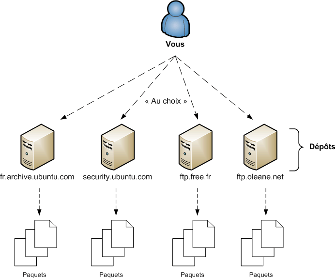

# Installer des programmes avec apt-get

Sous Linux (et notamment sous Ubuntu), ça ne fonctionne pas comme sur Windows, ou chaque éditeur de logiciel met en ligne son exe. Il faut toujours farfouiller dans le net pour savoir ou est tel ou tel logiciel.

Sur Linux, C'est encore plus simple. Mieux : vous allez vite vous rendre compte que c'est un vrai plaisir d'installer de nouveaux programmes et que c'est même un des points forts d'un système comme Ubuntu par rapport à Windows.

## Les paquets :
Sous Ubuntu, on n'a pas de programmes d'installation ; on a ce qu'on appelle des paquets.
Un paquet est une sorte de dossier zippé qui contient tous les fichiers du programme. Il se présente sous la forme d'un fichier.deb, en reférence à DEBian. Il contient toutes les instructions nécessaires pour installer le programme.

* il y a une gestion des dépendances du programme.
* Tous les .deb sont rassemblés au même endroit sur un même serveur appelé dépôt (repository).

Il est très rare qu'un programme puisse fonctionner seul. 
Très souvent, il utilise d'autres programmes ou d'autres « bouts de programmes » appelés bibliothèques. 
On dit que les programmes dépendent d'autres programmes pour fonctionner : ils ont des dépendances.

Vous avez certainement déjà rencontré un peu ce problème sous Windows. Par exemple, quand vous installez un jeu, on vous dit « Il faut installer Direct X avant de pouvoir jouer à ce jeu ».

Le système de paquets Debian est intelligent. Chaque paquet indique de quels autres paquets il dépend. 
Cela permet au système d'aller récupérer les dépendances manquantes automatiquement si besoin est.

## Les Dépots

Ceci est possible en partie grâce au fait que la plupart des programmes sous Linux sont libres. 
En effet, les programmes étant « libres », tout le monde est autorisé à les diffuser. 
Ça ne pose donc aucun problème de les voir tous rassemblés au même endroit.
Sous Windows, la majorité des programmes étant propriétaire, leurs auteurs n'auraient jamais donné leur accord pour que ceux-ci soient diffusés au même endroit (gratuitement, qui plus est).



Comme vous allez probablement beaucoup télécharger depuis votre dépôt, il est conseillé de choisir un serveur qui soit proche de chez vous (sur lequel vous téléchargez suffisamment vite).

En France, par défaut, Ubuntu utilise le dépôtfr.archive.ubuntu.com. 
Ce n'est pas toujours une bonne idée de garder le dépôt par défaut car en cas de nouvelle version d'Ubuntu et de ses logiciels, celui-ci est surchargé et devient alors très lent.

Le fichier à ouvrir qui contient la liste des dépôts que vous utilisez est :
```
/etc/apt/sources.list
```

Voici une ligne « type » :
```
deb http://fr.archive.ubuntu.com/ubuntu/ hardy universe
```

En premier paramètre, on a l'adresse du dépôt.
Ensuite, on a le nom de la version de la distribution qu'on utilise.
Enfin, le dernier paramètre (et tous les paramètres suivants s'il y en a) correspond à la « section » du dépôt dans laquelle vous voulez regarder.

## APT

Commençons par la mise à jour du cache des paquets (apt-get update).
Cela correspond à télécharger la nouvelle liste des paquets proposés par le dépôt.

Nous devons généralement suivre trois étapes pour télécharger un paquet :

    apt-get update (optionnel) : pour mettre notre cache à jour si ce n'est pas déjà fait ;

    apt-cache search monpaquet (optionnel) : pour rechercher le paquet que nous voulons télécharger si nous ne connaissons pas son nom exact ;

    apt-get install monpaquet : pour télécharger et installer notre paquet.

Si vous voulez désinstaller un paquet, vous pouvez utiliser la commandeapt-get remove :

    apt-get remove lbreakout2

Le paquet sera alors désinstallé de votre ordinateur.
Toutefois, cela ne supprime pas les dépendances du paquet devenues inutiles. 

    apt-get autoremove
    
Pour mettre a jour TOUS les paquets :

    apt-get upgrade
    

## dpkg

dpkg est le programme de base qui permet d'installer les paquets deb.
    
    dpkg -i programme.deb
    
Personnellement, je ne l'utilise pas car il gère très mal les dépendances. Je lui préfère gdebi

    gdebi -i programme.deb

## Appimage

https://fr.wikipedia.org/wiki/AppImage
AppImage est un format d'application portable développé pour Linux. Il permet d'installer et de lancer des applications sans avoir accès aux droits de superutilisateur.     

Il vise à simplifier le déploiement d'applications pour Linux : en n'exigeant pas les droits de superutilisateur pour l'installation, en embarquant les bibliothèques nécessaires à l'application dans le fichier AppImage, etc..

Cette alternative peut être utilisée pour utiliser un programme depuis n'importe quelle distribution Linux sans avoir à se soucier des dépendances ou de la compatibilité avec le système d'exploitation. 

## Snap

Avec le format snap, pour recevoir des nouvelles versions de logiciels, les utilisateurs n'auront plus à mettre en jeu la stabilité de leur système par l'ajout de dépôts personnels (PPA). Ils pourront récupérer un paquet .snap distribué par l'éditeur via le gestionnaire de paquets Snappy. 
L'application s'exécute ensuite de manière isolée, ce qui accroît la stabilité et la sécurité du système. 
Le paquet .snap inclut l'application et peut contenir aussi ses dépendances ; en contrepartie d'un paquet plus lourd. 
Ceux-ci peuvent donc faire cohabiter plusieurs versions de mêmes dépendances au sein d'un même système Linux et en facilite la distribution en ligne et hors ligne.

Les paquets .snap ne remplacent pas les paquets .deb classiques : le cœur du système Ubuntu (noyau, environnements graphiques, logiciels de base) continue d'être géré à l'aide des paquets issus de Debian. 

    snap info <nom-du-programme>
    sudo snap install nom_du_snap
    
Notamment, il peut-être intéressant d'utiliser l'option –classic qui évite le confinement et permet par exemple d'imprimer sur les imprimantes disponibles):

    sudo snap install --classic nom_du_snap 

Quelques Logiciels disponibles sous Snap, en tapant :

    snap find

Liste des logiciels installés sur votre ordinateur, en tapant :

    snap list


## Scripts d'install

Beaucoup d'éditeurs proposent d'installer leur programme avec script bash. Ce qui est en soit une solution pratique peut se révéler dangereux si vous ne savez pas ce qu'il y a dans le bash... Réfléchissez y !

## TP : 
installer Teamviewer, discord, sublime-text, docker, stacer, byobu, UltraScreen, Spotify, Gimp, keepassxc, skype, vlc

## En résumé

* La plupart des distributions Linux proposent un moyen centralisé de télécharger et d'installer des logiciels facilement. L'installation de programmes y est généralement beaucoup plus simple que sous Windows !
* Sous Ubuntu, on peut utiliser des interfaces graphiques pour télécharger et installer des logiciels. En console, on fait appel au programme ```apt-get```.
* On télécharge les programmes depuis des serveurs (fournis par Ubuntu, votre fournisseur d'accès ou une université) qui font office de dépôts.
* apt-get update met à jour la liste des programmes (appelés paquets) qui existent.
* apt-cache search permet de rechercher dans la liste des paquets.
* apt-get install télécharge et installe un paquet.
* apt-get upgrade met à jour tous les paquets installés.
* apt-get autoremove permet de supprimer un paquet et ses dépendances.
