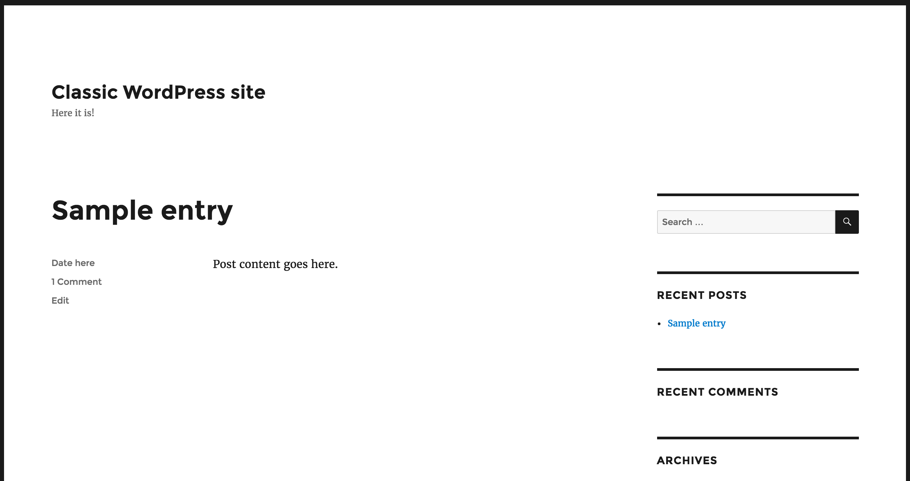
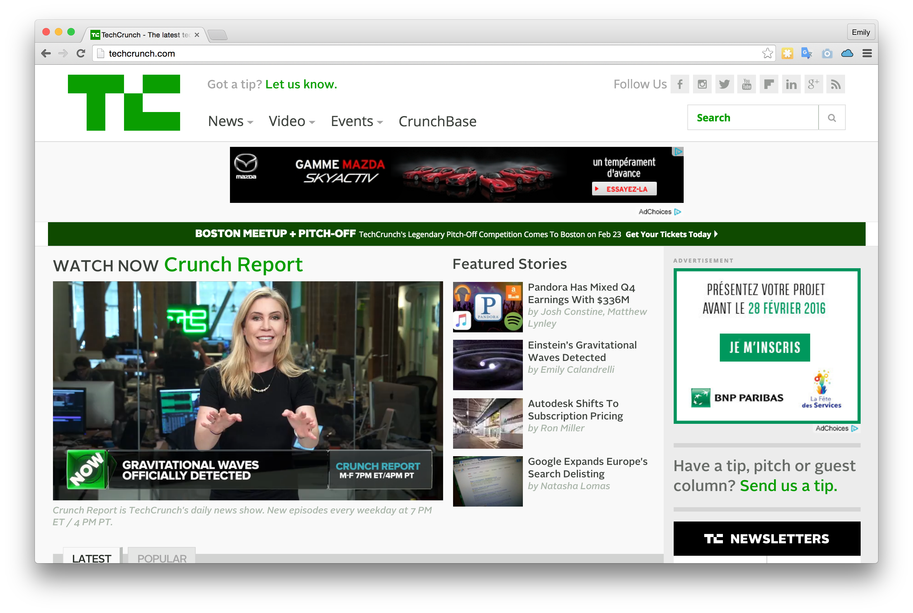

# Wordpress

## Introduction

WordPress est un CMS, pour Content Management System (système de gestion de contenu). On l’associe couramment à l’idée d’un service de blog, mais c’est en réalité bien plus que cela.
WordPress est utilisé par 26% des sites web ; cela signifie que la plate-forme contrôle 60% du marché.

Avantages :

- Facile à prendre en main
- Gratuit (hors hébergement)
- Solution tout en un
- Système de plug in et thème
- Très grosse communauté 
- Beaucoup, beaucoup de choix

Inconvénients :

- Beaucoup, beaucoup de choix
- En PHP :)
- Uniformisation des designs Web  
- Personnalisation limité par le thème installé

## Vocabulaire :

### Pages

Les pages sont l’un des deux concepts les plus importants de WordPress. Il s’agit d’une page distincte à l’intérieur d’un site WordPress, qui a son propre titre et son propre contenu. Cela peut être la page d’accueil, ou une page séparée, comme “À propos”, ou “Contact”. Pour ajouter une page dans WordPress, il suffit de cliquer sur un bouton.

### Articles

Les articles sont des entrées individuelles groupées ensemble sur une page. De nombreux sites WordPress affichent une page d’accueil qui liste tous les articles par ordre chronologique décroissant. Cela fonctionne très bien pour les blogs et les sites d’information, mais beaucoup moins bien pour d’autres types de contenu.

### Extensions

Les extensions sont des fonctionnalités que vous pouvez ajouter individuellement, elles étendent le pouvoir d’un site WordPress. On trouve notamment un simple captcha à ajouter à votre site, des fonctionnalités de sécurité, des formulaires de contact, des fonctionnalités de personnalisation d’image, des options d’analyse, et plus encore.

### Thèmes

Les thèmes sont un groupe de fichiers et de règles de style, qui vont déterminer l’apparence de votre site. En choisissant et en bidouillant un peu le thème qui vous convient, vous obtiendrez de très belles couleurs, polices et un très bon rendu visuel de votre site.

## L'hébergement.

- L'auto-hebergement.
	+ A la maison, sur un serveur WAMP sous Windows, Mac ou Linux
	+ Sur un VPS ou un serveur dédié loué avec l'outil Docker
- Les hébergeurs web standard
	+ OVH, LWS, etc... Nécessite un client FTP/SFTP
- Les hébergeur spécialisé wordpress
	+ Wordpress.com
	+ Themecloud

Les avantages de ces derniers sont les services supplémentaires qu'ils proposent. Sauvegardes quotidiennes, nom de domaine à rallonge gratuit, et parfois version d'essai.

## Wordpress 5

### Gutemberg

L’idée derrière Gutenberg : créer un éditeur de pages qui permet de visualiser les changements en temps réel. Le What You See Is What You Get

Il propose de créer du **contenu sous forme de blocs** :

- **Les “Common Blocks” (blocs communs)** : titres, galeries, blocs de texte, listes, vidéos, images seules…
- **Les “Mise en forme” (des blocs plutôt dédiés aux développeurs)** : vous pouvez notamment y trouver un bloc spécialement dédié à l’insertion de code, préformaté ou non, ou encore des tables.
- **Les “Mise en page” (blocs d’agencement)** : colonnes, boutons, séparateurs, barre “read more” – c’est ici que vous trouverez de quoi structurer votre page.
- **Les “Widgets” (classiques de WordPress)**  : c’est par ici que vous pourrez trouver un bloc pour intégrer une  liste de vos catégories, de vos derniers articles, ou encore un bloc  dédié à un shortcode, qui permettra de bien isoler celui-ci dans votre  page. Il y a fort à parier qu’on verra [plus de widgets](https://wpmarmite.com/widget-wordpress/) intégrés à l’éditeur dans les mois à venir.
- **Les “Contenus embarqués” (Embeds) **  : ces blocs vous permettront, en rentrant uniquement l’URL, d’intégrer à  votre page un tweet, une playlist Spotify, un post Instagram, une vidéo  TED… et tout type de flux issu d’un site externe. Une fonctionnalité  déjà possible via l’éditeur visuel historique, mais qu’il fait bon de  retrouver chez Gutenberg.
- **Les "Réutilisables"** : la possibilité de créer des blocs réutilisables, qui fonctionneront comme des **mini-templates**. Un élément pratique, imitant ce que des constructeurs de page comme Visual Composer permettent déjà de faire.

Quelques fonctions pratique :

- **L'auto Complétion** pour régider sans toucher la souris : " / "

### Creation d'un menu

Dans **Apparence / Menus**